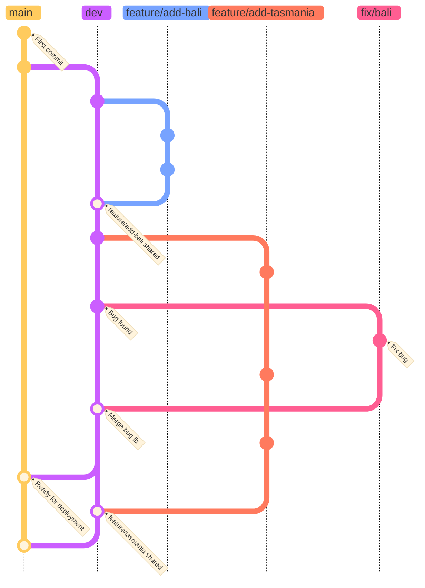

# Contributing

## Rule of Conduct

 TODO: Jot down a first draft about how to behave as a team member.

 ###  Clone the repository

 TODO

### Fix Typos or Grammar Errors in the HTML pages

TODO:

### Add a Country

TODO:

### Git workflow

Today we use the *GitHub Flow*.

We aim to switch to using a *lightweight* version of the *Git Flow* instead for the feature, integration and release process.

We made several adjustments to the original Git Flow:

- We use `dev` instead of `develop` as the integration branch.
- We do **not** use *release* nor *hotfix* branches.

- **`dev`** is a branch where developers share common code.
- **`feature/xxx`**  A developer create a **feature branch** forked off `dev`, such as `feature/add-new-zealand`, (use a dash sign (`-`) in between words), then add commits to it.  
  Once this feature branch is ready to be shared with others, he/she merge it into `dev`.
- **`main`** should contain the production ready code, tht is the stable version of our website.  
  We configured the repository to deploy the `main` branch automatically to GitHub web servers with *GitHub Pages*, each time the `main` branch is pushed to GitHub.

### Add a Commit

TODO:

### How to Write a Commit Message

TODO:

### Push Changes to the Remote Repository

TODO:

###  Submit a Pull Request

This section describes how to submit a new feature or a bug/typo fix.

TODO:

### How to Create a GitHub Issue

TODO:
